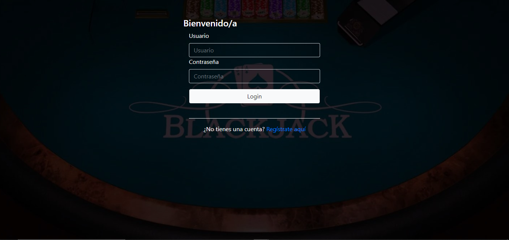

# Proyecto JSP

Proyecto que consiste en un juego de cartas llamado blackjack. Antes de poder jugar se necesita registrar e iniciar sesión con un usuario, dentro de la pagina tienes varias seccione, 
una que te muestra una tabla con los usuarios registrados con sus datos y sus victorias y derrotas en el juego, otra con las instrucciones y un botón para jugar y una pestaña para actualizar tu usuario.
Dentro del juego al principio saldran todas las cartas boca abajo y necesitarás clickear en pedir carta, ahi empieza el juego, una vez ganas, pierdas o empates saldra un mensaje junto a las puntuaciones y 
dos botones uno para volver a jugar y otro para volver al inicio

# Capturas

